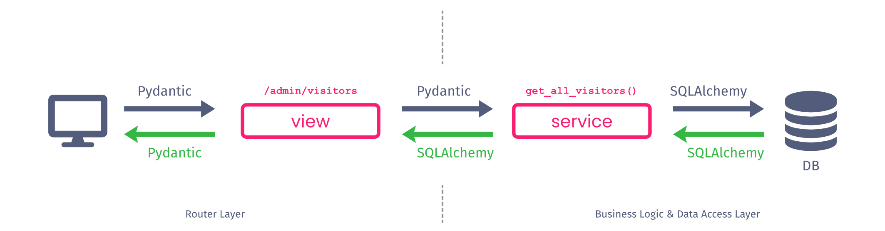

# Australian Synchrotron Open Day Scavenger Hunt

The Open Day Scavenger Hunt is an interactive activity that the Scientific Computing team of the Australian Synchrotron is organising for the 2024 Open Day. This repository contains the complete web application for this activity.

Visitors of the Open Day will be tasked to solve little puzzles, scattered around the Australian Synchrotron facility. Each puzzle is connected to a QR code which, after scanning the code, is presented as a webpage to the visitor on their phone. By entering the correct answers, visitors solve the puzzles and can win prices.

During the Open Day a visitor is guided through the following steps:
1. The visitor registers at the registration desk by scanning a personalised QR code with their phone's camera or a QR scanner app. The code directs them to the scavenger hunt web application, generates an anonymous session and registers them in the application's database.
2. The visitor explores the facility and keeps an eye out for QR codes. If they find a QR code, they scan it with the scavenger hunt web application. The puzzle is displayed in the application.
3. The visitor solves the puzzle and enters their answer into the web application. The answer is compared with the correct answer stored in the database and they receive immediate feedback in the web application.
4. Once the visitor has solved all puzzles, they return to the registration desk and pick up their prize.


## Installation
The web application is written in Python, the language of choice for the Scientific Computing team at the Australian Synchrotron. The following sections explain two methods to install and run the application locally.

Before choosing one of the methods, make sure you have the source code of the application. Currently there is no released version of the project, therefore the first step is to clone the repo:

```
git clone git@github.com:AustralianSynchrotron/openday-scavenger.git  # Using ssh key (preferred)
or
git clone https://github.com/AustralianSynchrotron/openday-scavenger.git # Using https with username/password credentials
```
If testing the application, use the `main` branch.

### Option 1: Use Virtual Environments
This is the quickest and easiest method to run the scavenger hunt web application. It uses a local database and demonstrates the power of virtual environments for local Python development.

#### Setup

##### Install dependencies
The web application makes use of [`uv`](https://github.com/astral-sh/uv) for installing dependencies and creating the virtual environment.

If you don't have `uv` installed yet, get it on Linux with:
```
curl -LsSf https://astral.sh/uv/install.sh | sh
```
For other operating systems please see [here](https://docs.astral.sh/uv/getting-started/installation).


The application requires Python 3.12. If you don't have this version installed yet, the easiest way is to use `uv`:
```
uv python install 3.12
```

Install all the dependencies inside a virtual environment with:
```
uv sync
```

##### Setup a pre-commit hook
These instructions describe using `uvx` to run [pre-commit](https://pre-commit.com/). `pre-commit` is a tool to configure pre-commit `git` hooks. `uvx` is not the only viable method to run `pre-commit` (an alternative is e.g., `pipx`)

Install `pre-commit` as a `uv` tool:
```
uv tool install pre-commit
```
This installs `pre-commit` in its own, persistent, virtual environment so that it can be used for any project.

`cd` to the repo and run:
```
uvx pre-commit install
```
This installs the pre-commit hook in `.git/hooks`.

Finally, to test, run the hook against all the files:
```
uvx pre-commit run --all-files
```

Now whenever a commit is made `ruff` will format, lint, and sort imports, for any changed files.

#### Run the Application
Run the web application using its internal development server with:
```
uv run fastapi dev ./openday_scavenger/main.py
```

If you want to modify the code, start the server with auto-reloading to avoid having to manually restart the application after code changes:
```
uv run fastapi dev ./openday_scavenger/main.py --reload
```

Open a web browser and go to `http://localhost:8000`.

#### Persistent Data
By default, the web application will use an in-memory sqlite database. If you like to persist the data over restarts of the application, use a file based sqlite database. Create a `.env` file in the repository's root folder with the following content (you can adjust the filename to your liking):
```
DATABASE_SCHEME=sqlite
DATABASE_NAME="scavenger_hunt.db"
```
Restart the server and it will pick up the settings automatically.

### Option 2: Use devcontainers (with VSCode)
If you would like a setup which is similar to a real production environment, use the provided [devcontainer](https://containers.dev). It uses a proper PostgreSQL database server instead of sqlite.

> Before you can use devcontainers make sure you have Docker as well as the VSCode [Remote Development](https://marketplace.visualstudio.com/items?itemName=ms-vscode-remote.vscode-remote-extensionpack) extensions installed. Please refer to the dev container setup documentation on the VSCode page.

Open the cloned repository in [VSCode](https://code.visualstudio.com). Usually it will detect that a `.devcontainer` folder is present and ask you whether you'd like to "Reopen folder to develop in a container". Press "Reopen in Container" and wait.

If VSCode does not prompt you, click on the button on the very bottom left of VSCode and select "Reopen in Container" from the drop down menu at the top.

Once the containers have finished starting up, browse to `http://localhost:8000` in a web browser.

If you would like to see the content of the database with a database client (a GUI client we like is [DBeaver](https://dbeaver.io)), use the following settings:

| Setting  | Value |
| -------  | ----- |
| host     | `localhost` |
| port     | `5432` |
| db       | `postgres` |
| user     | `postgres` |
| password | `postgres` |


## The Visitor Flow
TBD

## Contribution
We would be delighted to receive contributions, especially in the form of puzzles. Please note that we are preparing for the Open Day 2024 and thus will only be able to accept contributions from Australian Synchrotron facility staff at this point in time.

All contributions are done via Pull Requests (PR). You can either fork the repository and send a PR through or create a branch in the upstream repository and send a merge request via PR. In both cases, please create a branch starting with your initials and a few words about the main work topics. For example `am-puzzle-admin-edit-fields`.

For the Pull Request please request either Andreas or Stephen as a reviewer.

Along with the PR requirement, the `main` branch is also protected by a status check. The status check runs a [GitHub Action](https://github.com/AustralianSynchrotron/openday-scavenger/actions/workflows/pytest.yaml) that checks the linting and formatting with `ruff` and runs the tests with `pytest`. The use of the pre-commit hook should ensure the linter and formatter pass.

## Add a Puzzle
The heart and soul of the scavenger hunt web application are its puzzles. This sections describes the process of adding a puzzle and integrating it into the user experience and administration flow.

You will find a `demo` puzzle in the repository that you can use as an example or a basis for your own puzzle.


### Step 0: Preparation
The web application uses a simple Cookie-based session management to track visitors. This system is a little bit annoying when developing new puzzles. We recommend to turn it off during development by adding the following parameter to your `.env` file:
```
SESSIONS_ENABLED="false"
```


### Step 1: The Name
Pick a name for your puzzle. It should be one word (no whitespaces), can be a bit cryptic and needs to be unique among all puzzles. You will use the name in a few places, so coming up with a good initial name will make your life a lot easier.

We will use the very creative puzzle name of `demo` to illustrate the process in the following.

### Step 2: The Folder
Create a folder under `openday_scavenger/puzzles` with your puzzle name.

In our example you will find the `demo` puzzle under `openday_scavenger/puzzles/demo`

### Step 3: The Core Files
In your puzzle folder create a `__init__.py` file and a file that will host the routes for your puzzle, for instance `views.py`. You can create as many files in your folder as you like, but these two are the minimum you will need.

Within your routes file define the root route for your puzzle. You can define as many additional routes as you like, but we need at least one root route.

The following example doesn't implement a rendered puzzle page yet, but demonstrates the basics of a root route :
```Python
from fastapi import APIRouter

router = APIRouter()

@router.get('/')
async def index():
    return {"test": "test"}
```

### Step 4: Register your Puzzle Route
In order to make your puzzle visible to the world, register its API router. Attach it to the overarching puzzle router in the file `openday_scavenger/puzzles/__init__.py`.

Add an `import` and a `include_router` statement like the following to the list of puzzle routes:

```Python
from .[your puzzle name].views import router as puzzle_[your puzzle name]_router

router.include_router(puzzle_[your puzzle name]_router, prefix='/[your puzzle name]')
```

### Step 5: Enable your Puzzle
With your puzzle root route created and registered your puzzle will be available under `http://localhost:8000/puzzles/[your puzzle name]`

However, when you try to browse to your puzzle, you will be greeted with a "Unknown Puzzle" error. This is because we will need to add your puzzle to the database. While this seems like an unnecessary step first, having the puzzle added to the database allows us to not only store the correct answer to the puzzle in a central place but also enables us to take puzzles offline with the click of a button in case something is not working.

Browse to the puzzle administration area `http://localhost:8000/admin/puzzles` and add a your puzzle to the database by entering the name of your puzzle and click "Add new Puzzle".

Then click on the "Enable" button next to your puzzle. Now when you browse to `http://localhost:8000/puzzles/[your puzzle name]` you will see your puzzle.

### Step 6: Growing your Puzzle
The steps above are only the beginning of your puzzle implementation journey. You will most likely want to serve rendered web pages, possibly dynamic content via JavaScript and more.

The `demo` example in the repository uses a folder called `static` to host static assets such as the puzzle html page and jinja2 to render the page. Feel free to use this code as a starting point for your own puzzle.

### Step 7: Submitting a Puzzle Answer
At some point your puzzle will need to submit the visitor's answer and display whether it is correct or not. This is accomplished by sending a `POST` request to the endpoint `/submission` with the following content encoded as `multipart/form-data`:

| Key  | Value |
|----  | ------|
| visitor | The uid of the visitor submitting the answer |
| name | The name of your puzzle |
| answer | The answer that the visitor entered |

While the name of the puzzle and the answer is easy to collect, the visitor uid is a bit more complicated. You get the visitor uid from the authenticated visitor using the `get_auth_visitor` dependency:
```Python
from typing import Annotated
from fastapi import APIRouter, Request, Depends

from openday_scavenger.api.visitors.schemas import VisitorAuth
from openday_scavenger.api.visitors.dependencies import get_auth_visitor


router = APIRouter()

@router.get('/')
async def index(request: Request, visitor: Annotated[VisitorAuth, Depends(get_auth_visitor)]):
    pass
```

After you made the request you will receive a response with the `JSON` body containing a boolean value indicating whether the asnwer was correct or not:
```JSON
{
    "success": True
}
```

The reason for storing the correct answer in the database is twofold:
- we don't want to reveal the correct answer in the source code
- we can quickly fix an incorrect answer by modifying the database entry

> For the time being the application only supports a case-sensitive, direct string comparison. If you need a more complex comparison method, such as a fuzzy comparison mode or computational methods (e.g. Levenshtein distance), please let Andreas or Stephen know.


## Architecture
The architecture of the web application is informed by the Scientific Computing standard for RESTful APIs. The standard the team follows is very closely modelled after structures such as the [Netflix Dispatch service](https://github.com/Netflix/dispatch) or the abstraction model described [here](https://camillovisini.com/coding/abstracting-fastapi-services).

The following diagram illustrates the two layers our services are generally split into. Requests to the service are made using parameters defined in `pydantic` schemas. The routes responding to requests are implemented in a view module focusing solely on the validation of input and assembly of the response. In order to accomplish this, the routes make calls to functions defined in the service module. The service module hosts all business logic and data access calls. This allows the business logic to be used across multiple routes and easy to test. The service functions take `pydantic` schemas as inputs which can, but don't need to be, the same schemas as the ones used in the view module. In order to make things easier, often the service functions use standard arguments in addition or instead of `pydantic` models.

A service function takes the `pydantic` schema and, depending on the use case, translates it into a `SQLAlchemy` model for database calls. The result of the database call is a `SQLAlchemy` model which is returned to the route in the view model. The route then translates the `SQLAlchemy` model into a `pydantic` schema for the response.



The scavenger hunt application differs to the Scientific Computing standard RESTful API in that it renders web pages and provides a way for developers to extend it with puzzles. The folder structure is as follows:

```
|- openday_scavenger
|  |- api
|  |  |- puzzles            #common service functions for puzzles management
|  |  |- visitors           #common service functions for visitor handling
|  |- puzzles
|  |- static
|  |  |- css
|  |  |- html
|  |  |- js
|  |  |- webfonts
|  |- views
|  |  |- admin
|  |  |- game

```


## Technologies and Libraries
The scavenger hunt web application makes use of a mix of our standard libraries that we use in Scientific Computing and a few new ones that we wanted to try out.

| Library  | Reason |
| -------- | ------- |
| [uv](https://github.com/astral-sh/uv) | An extremely fast alternative to [Poetry](https://python-poetry.org). Poetry is our standard for dependency management and virtual environments, but this project provided a great opportunity to try out `uv`.
| [FastAPI](https://github.com/fastapi/fastapi)  | Our standard web framework for all RESTful and websocket APIs. |
| [SQLAlchemy](https://www.sqlalchemy.org)| Our standard ORM for SQL databases. |
| [jinja2](https://jinja.palletsprojects.com) | Our standard for templating, including the rendering of web pages. |
| [reportlab](https://docs.reportlab.com) | Our preferred library for generating PDF files. |
| [segno](https://github.com/heuer/segno)| A QR code generator that we like. |
| [ruff](https://github.com/astral-sh/ruff)| Our standard linter and code formatter for Python. |
| [mypy](https://mypy-lang.org)| Our standard type checker for Python. |
| [htmx](https://htmx.org) | We usually use [ReactJS](https://react.dev)/[NextJS](https://nextjs.org) for our web frontends. But those frameworks seemed too heavy for this project, thus we decided to give `htmx` a go for the common game and admin pages.  |
| [html5-qrcode](https://github.com/mebjas/html5-qrcode)| The QR scanner JavaScript library. This one seemed to work nicely and was least out of date of all the available QR scanner libraries. |
| [Bootstrap](https://getbootstrap.com) | We use a variety of styling libraries for our web services but for this project Bootstrap was the easiest and quickest way to introduce some decently styled components. |
